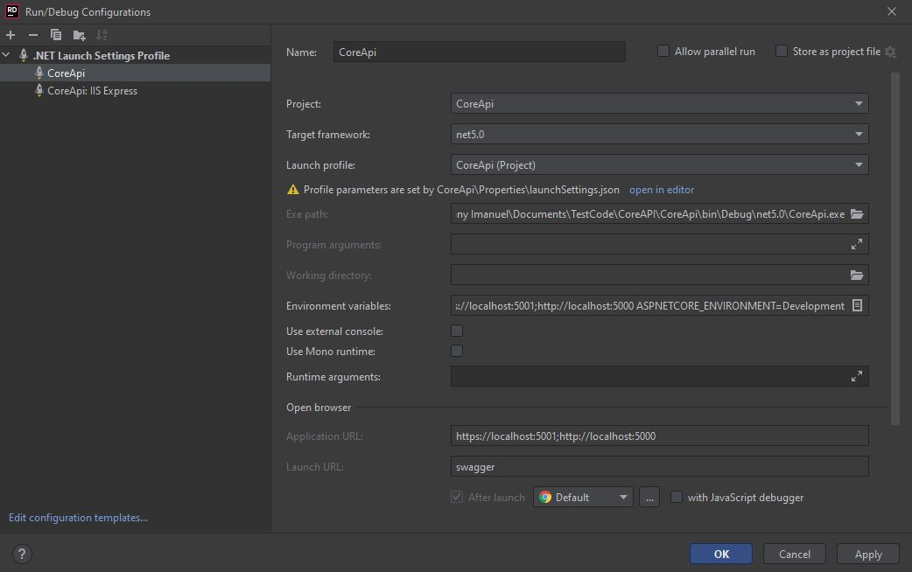
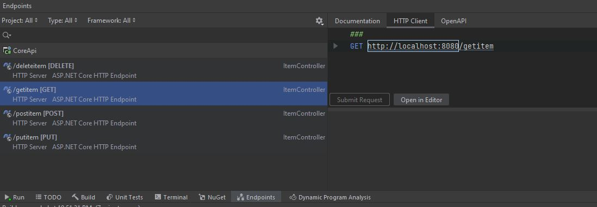
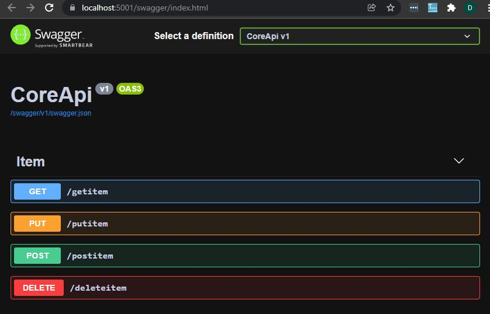

# Core API
by Denny Imanuel

This project shows how to build C#.Net Core API

### Requirement

1. Rider IDE - you need to install Rider IDE
2. DotNet Core - you need to install DotNet Core

### Run Configuration

On Rider Run Configuration choose .Net Launch Setting configuration and set as follows:

### Api Endpoint

Once you run the SpringApi configuration the endpoints will shows up as below:

# Swagger UI

Run the browser on http://localhost:5001/swagger/index.html you'll see the Swagger UI:

